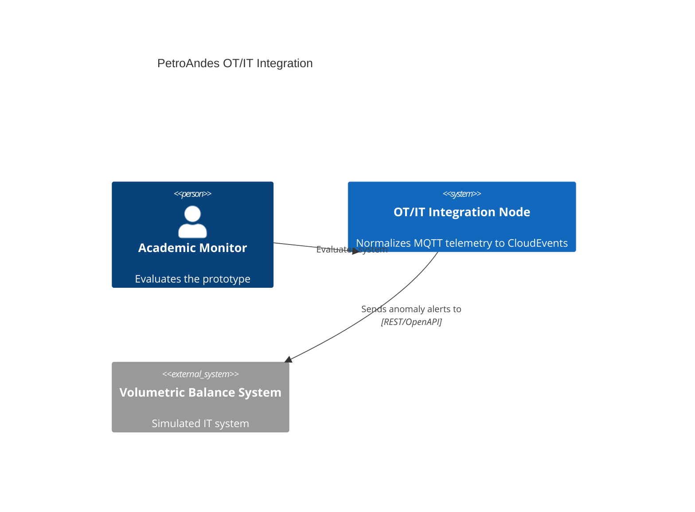

```mermaid
C4Context
  title PetroAndes OT/IT Integration
  
  Person(admin, "Academic Monitor", "Evaluates the prototype")
  System(bridge, "OT/IT Integration Node", "Normalizes MQTT telemetry to CloudEvents")
  System_Ext(volumetric, "Volumetric Balance System", "Simulated IT system")
  
  Rel(admin, bridge, "Evaluates system")
  Rel(bridge, volumetric, "Sends anomaly alerts to", "REST/OpenAPI")

```
