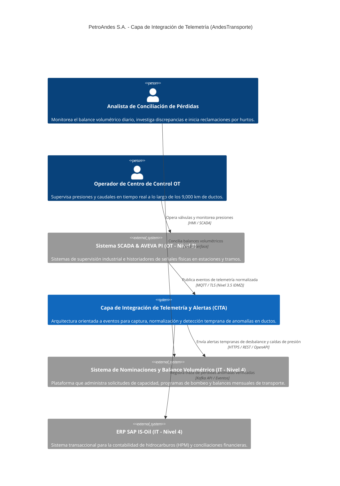
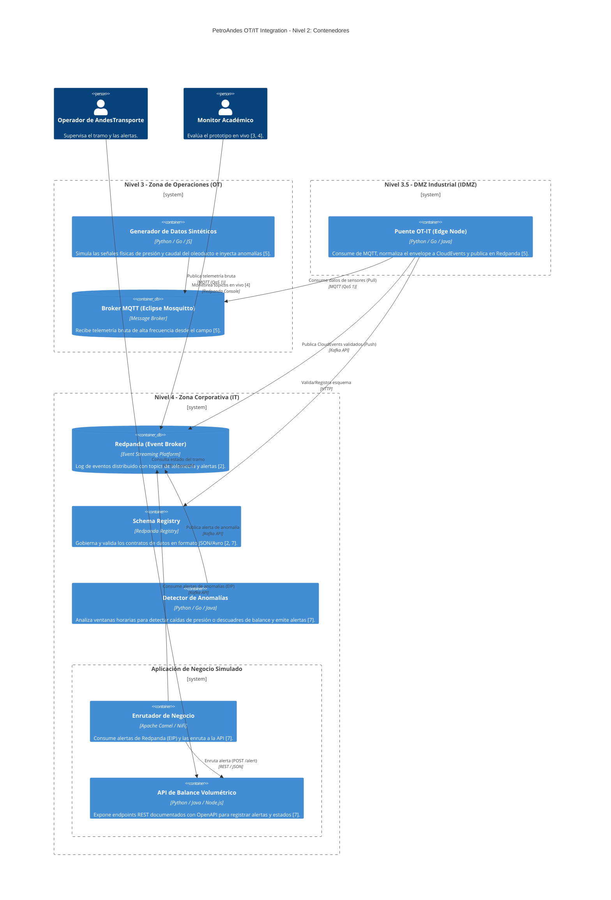

Nivel 1: Contexto del Sistema

```mermaid
C4Context
  title PetroAndes S.A. - Capa de Integración de Telemetría (AndesTransporte)
  
  Person(analista, "Analista de Conciliación de Pérdidas", "Monitorea el balance volumétrico diario, investiga discrepancias e inicia reclamaciones por hurtos.")
  Person(operador_ot, "Operador de Centro de Control OT", "Supervisa presiones y caudales en tiempo real a lo largo de los 9,000 km de ductos.")
  
  System_Ext(scada, "Sistema SCADA & AVEVA PI (OT - Nivel 3)", "Sistemas de supervisión industrial e historiadores de señales físicas en estaciones y tramos.")
  
  System(telemetry_layer, "Capa de Integración de Telemetría y Alertas (CITA)", "Arquitectura orientada a eventos para captura, normalización y detección temprana de anomalías en ductos.")
  
  System_Ext(snbv, "Sistema de Nominaciones y Balance Volumétrico (IT - Nivel 4)", "Plataforma que administra solicitudes de capacidad, programas de bombeo y balances mensuales de transporte.")
  System_Ext(sap, "ERP SAP IS-Oil (IT - Nivel 4)", "Sistema transaccional para la contabilidad de hidrocarburos (HPM) y conciliaciones financieras.")
  
  Rel(scada, telemetry_layer, "Publica eventos de telemetría normalizada", "MQTT / TLS (Nivel 3.5 IDMZ)")
  Rel(telemetry_layer, snbv, "Envía alertas tempranas de desbalance y caídas de presión", "HTTPS / REST / OpenAPI")
  Rel(telemetry_layer, sap, "Registra traza de pérdidas anómalas verificadas", "Kafka API / Eventos")
  Rel(analista, snbv, "Concilia balances volumétricos", "Web Interface")
  Rel(operador_ot, scada, "Opera válvulas y monitorea presiones", "HMI / SCADA")


```

Nivel 2: Contenedores

```mermaid
C4Container
  title PetroAndes OT/IT Integration - Nivel 2: Contenedores

  Person(operador, "Operador de AndesTransporte", "Supervisa el tramo y las alertas.")
  Person(monitor, "Monitor Académico", "Evalúa el prototipo en vivo [3, 4].")

  Boundary(ot_zone, "Nivel 3 - Zona de Operaciones (OT)") {
    Container(sensors, "Generador de Datos Sintéticos", "Python / Go / JS", "Simula las señales físicas de presión y caudal del oleoducto e inyecta anomalías [5].")
    ContainerDb(mosquitto, "Broker MQTT (Eclipse Mosquitto)", "Message Broker", "Recibe telemetría bruta de alta frecuencia desde el campo [5].")
  }

  Boundary(idmz, "Nivel 3.5 - DMZ Industrial (IDMZ)") {
    Container(bridge, "Puente OT-IT (Edge Node)", "Python / Go / Java", "Consume de MQTT, normaliza el envelope a CloudEvents y publica en Redpanda [5].")
  }

  Boundary(it_zone, "Nivel 4 - Zona Corporativa (IT)") {
    ContainerDb(redpanda, "Redpanda (Event Broker)", "Event Streaming Platform", "Log de eventos distribuido con topics de telemetría y alertas [2].")
    Container(registry, "Schema Registry", "Redpanda Registry", "Gobierna y valida los contratos de datos en formato JSON/Avro [2, 7].")
    Container(detector, "Detector de Anomalías", "Python / Go / Java", "Analiza ventanas horarias para detectar caídas de presión o descuadres de balance y emite alertas [7].")
    
    Boundary(business_app, "Aplicación de Negocio Simulado") {
      Container(router, "Enrutador de Negocio", "Apache Camel / NiFi", "Consume alertas de Redpanda (EIP) y las enruta a la API [7].")
      Container(volumetric_api, "API de Balance Volumétrico", "Python / Java / Node.js", "Expone endpoints REST documentados con OpenAPI para registrar alertas y estados [7].")
    }
  }

  %% Flujos de Datos
  Rel(sensors, mosquitto, "Publica telemetría bruta", "MQTT (QoS 1)")
  Rel(bridge, mosquitto, "Consume datos de sensores (Pull)", "MQTT (QoS 1)")
  Rel(bridge, registry, "Valida/Registra esquema", "HTTP")
  Rel(bridge, redpanda, "Publica CloudEvents validados (Push)", "Kafka API")
  
  Rel(detector, redpanda, "Consume telemetría de ductos", "Kafka API")
  Rel(detector, redpanda, "Publica alerta de anomalía", "Kafka API")
  
  Rel(router, redpanda, "Consume alertas de anomalías (EIP)", "Kafka API")
  Rel(router, volumetric_api, "Enruta alerta (POST /alert)", "REST / JSON")
  
  Rel(operador, volumetric_api, "Consulta estado del tramo", "HTTP / OpenAPI")
  Rel(monitor, redpanda, "Monitorea tópicos en vivo [4]", "Redpanda Console")


```

